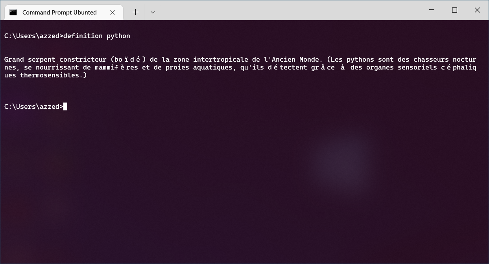

# python-cli

A set of commands line write in Python.

## Applications

### todo-list

A todo list with file persistence.

<p align="center">
    
</p>

### definition

A command to get a french definition for a word (from larousse).

<p align="center">
    
</p>

### note

A command to write fast note.

<p align="center">
    
</p>

### translate

A command to translate a word from english to french. Doesn't work !! (reason : library googletrans).

## How to install

```sh
python -m build
pip install ./dist/python_cli-0.0.4-py3-none-any.whl
```